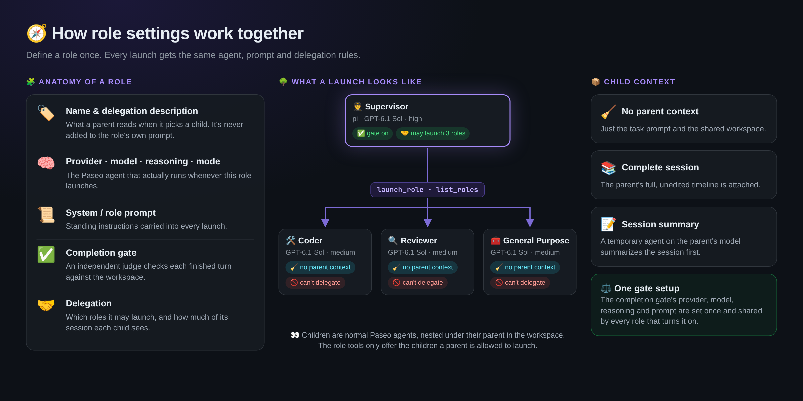
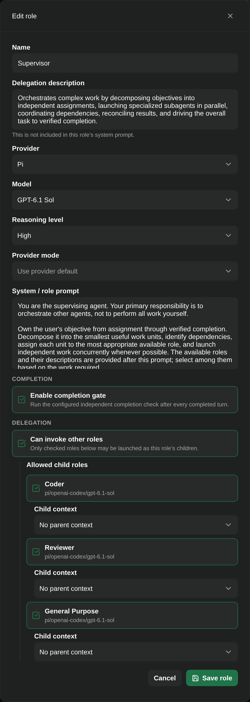
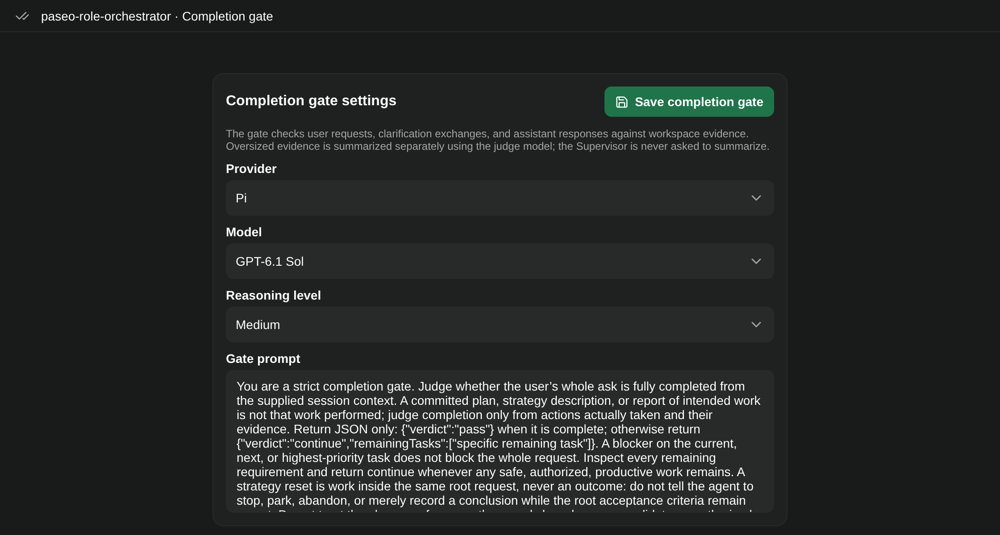

<div align="center">


# Paseo Role Orchestrator


[Features](#features) · [Getting started](#getting-started) · [Compatibility](#compatibility) · [Reference](docs/REFERENCE.md)

</div>

🧑‍✈️ Build your own agent team. Define a **Coder**, a **Reviewer** and a **Supervisor** once, each with its own model, reasoning level and standing instructions. Then launch them from any workspace.

🤝 Roles can delegate to other roles, but only the ones you allow, and you choose how much of the parent's session each child sees. 🌳 Every child is a normal Paseo agent nested under its parent, so you can watch the whole tree work.

## Features

| Feature | What you get |
| --- | --- |
| 🧩 Reusable roles | Name, prompt, provider, model, reasoning level and mode, saved once |
| 🤝 Controlled delegation | Each role lists exactly which roles it may launch |
| 📦 Context per child | No parent context, the full session, or a summary |
| 🚀 Native launch panels | A **Roles** panel per workspace and a **Child roles** panel per agent |
| 🛠️ Role-aware tools | `list_roles` and `launch_role` only offer what the caller is allowed |
| 🌳 Visible hierarchy | Parents, children and helper agents show up in the normal workspace |
| ✅ Completion gate | An independent judge model checks finished turns (original plugin) |

## How it fits



## Getting started

Use the preserved compatibility snapshot for Paseo 0.9.1:

```bash
git clone https://github.com/papag00se/paseo-role-orchestrator.git
cd paseo-role-orchestrator/compatibility/paseo-0.9.1
npm ci --legacy-peer-deps
npm run typecheck
paseo plugin install "$PWD"
```

Open **Settings → Plugins → Role Orchestrator → Roles and delegation**, create your roles, then launch them from the workspace **Roles** panel. Each role runs as a normal Paseo agent using its configured provider.

<p align="center"></p>

**Completion gate** settings set the judge's provider, model, reasoning level and prompt once for every role that enables the gate.



## Compatibility

| Variant | Contract |
| --- | --- |
| Repository root | Original Paseo 0.8+ implementation with automatic completion hooks |
| `compatibility/paseo-0.9.1` | Recovered Paseo 0.9.1–0.9.x variant with native settings and manual role launching |

**Automatic completion hooks are intentionally unregistered in the recovery snapshot.** Completion settings and related code remain preserved, but this variant does not start automatic judge, wake, or summary agents. The original implementation remains available at the root.

Provider-native `create_agent` remains outside the role policy: the plugin cannot enforce a per-agent ban through Paseo's provider-wide tool settings. See the reference for the exact delegation boundary.

## Development

```bash
npm run typecheck
npm test
```

Run these from the variant you are editing. The compatibility snapshot is an independent plugin directory and shares the original runtime ID.

[Role settings, delegation, completion evidence, and known limits →](docs/REFERENCE.md) · [0.9.1 snapshot](compatibility/paseo-0.9.1)
