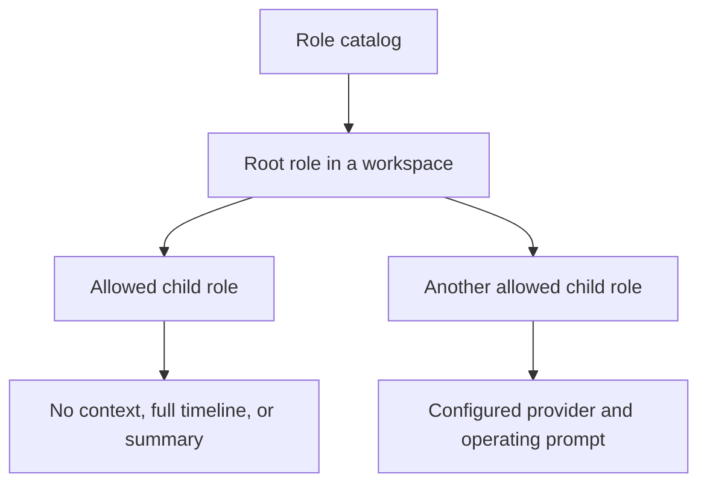

<div align="center">


# Paseo Role Orchestrator


[Features](#features) · [Getting started](#getting-started) · [Compatibility](#compatibility) · [Reference](docs/REFERENCE.md)

</div>

Define specialist agent roles once, then launch and delegate through them inside Paseo. Each role carries its own model settings, operating prompt, and child-delegation policy while keeping real parent/child relationships in the workspace.

## Features

| Feature | What you get |
| --- | --- |
| Reusable roles | A daemon-local catalog with prompts, descriptions, and provider/model settings |
| Controlled delegation | Allowed-child-role lists and per-child context policies |
| Native launch panels | Workspace Roles and agent Child roles panels |
| Role-aware tools | `list_roles` and `launch_role` are scoped to plugin-launched agents |
| Visible hierarchy | Follow root roles, children, and helper agents in the normal workspace |
| Completion controls | Root implementation includes optional completion checks and evidence handling |

## How it fits



## Getting started

Use the preserved compatibility snapshot for Paseo 0.9.1:

```bash
git clone https://github.com/papag00se/paseo-role-orchestrator.git
cd paseo-role-orchestrator/compatibility/paseo-0.9.1
npm ci --legacy-peer-deps
npm run typecheck
paseo plugin install "$PWD"
```

Open **Settings → Plugins → Role Orchestrator → Roles and delegation**, create your roles, then launch them from the workspace **Roles** panel. Each role runs as a normal Paseo agent using its configured provider.

## Compatibility

| Variant | Contract |
| --- | --- |
| Repository root | Original Paseo 0.8+ implementation with automatic completion hooks |
| `compatibility/paseo-0.9.1` | Recovered Paseo 0.9.1–0.9.x variant with native settings and manual role launching |

**Automatic completion hooks are intentionally unregistered in the recovery snapshot.** Completion settings and related code remain preserved, but this variant does not start automatic judge, wake, or summary agents. The original implementation remains available at the root.

Provider-native `create_agent` remains outside the role policy: the plugin cannot enforce a per-agent ban through Paseo's provider-wide tool settings. See the reference for the exact delegation boundary.

## Development

```bash
npm run typecheck
npm test
```

Run these from the variant you are editing. The compatibility snapshot is an independent plugin directory and shares the original runtime ID.

[Role settings, delegation, completion evidence, and known limits →](docs/REFERENCE.md) · [0.9.1 snapshot](compatibility/paseo-0.9.1)
